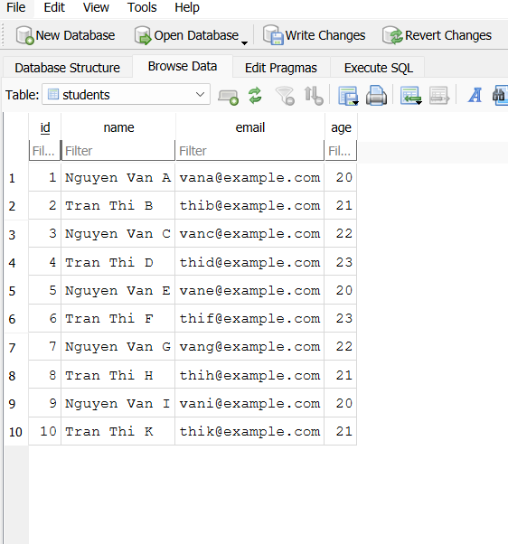
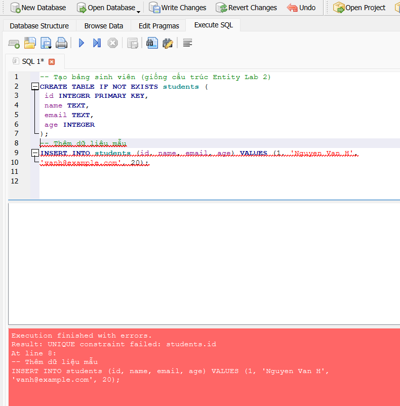
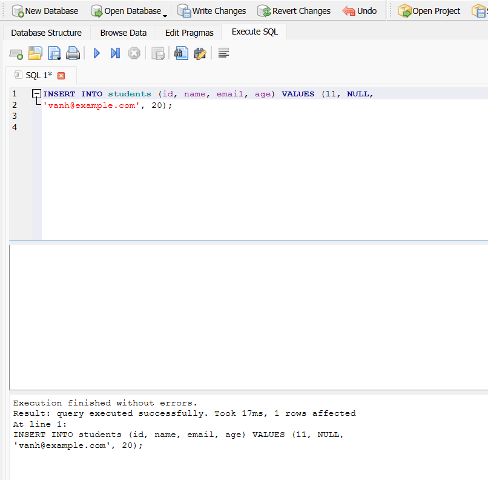
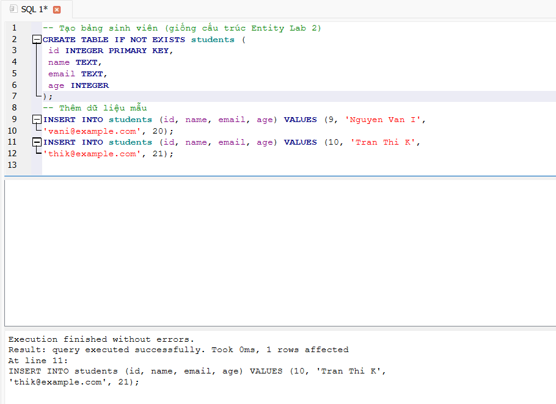

# cnpmnc-lab

## Thông tin nhóm

| Họ và tên        | MSSV    |
| ---------------- | ------- |
| Nguyễn Chí Trung | 2213696 |

## Web Service

**URL:** https://student-management-api-knrt.onrender.com/students

## Hướng dẫn chạy dự án

### Chạy Local (Development Mode)

Bước 1: Clone repository
git clone https://github.com/trungnguyen2004/cnpmnc-lab.git
cd student-management

Bước 2: Cấu hình Database

Tạo file .env tại thư mục gốc của project:

POSTGRES_HOST=localhost
POSTGRES_PORT=5432
POSTGRES_DB=student_management
POSTGRES_USER=postgres
POSTGRES_PASSWORD=your_password

Bước 3: Tạo Database trong PostgreSQL

Mở PostgreSQL và chạy:

CREATE DATABASE student_management;
Bước 4: Chạy ứng dụng
Linux / macOS:
./mvnw spring-boot:run
Windows:
mvnw.cmd spring-boot:run
Bước 5: Truy cập ứng dụng

Mở trình duyệt và truy cập:

http://localhost:8080/students

### Chạy bằng Docker

Bước 1: Build Docker Image
docker build -t student-management .
Bước 2: Run Container
docker run -p 8080:8080 \
-e DATABASE_URL=jdbc:postgresql://localhost:5432/student_management \
-e DB_USERNAME=postgres \
-e DB_PASSWORD=your_password \
student-management
Bước 3: Truy cập
http://localhost:8080/students

### Chạy phiên bản đã Deploy

Public URL của hệ thống: https://student-management-api-knrt.onrender.com/students

⚙️ Cấu Hình Quan Trọng

Trong application.properties:

spring.application.name=student-management
server.port=${PORT:8080}

spring.datasource.url=${DATABASE_URL:jdbc:postgresql://localhost:5432/student_management}
spring.datasource.username=${DB_USERNAME:postgres}
spring.datasource.password=${DB_PASSWORD:password}
spring.datasource.driver-class-name=org.postgresql.Driver

spring.jpa.hibernate.ddl-auto=update
spring.jpa.show-sql=true
spring.jpa.properties.hibernate.dialect=org.hibernate.dialect.PostgreSQLDialect

## Các Lỗi Thường Gặp

Quên thêm tiền tố jdbc: vào DATABASE_URL

PostgreSQL chưa chạy

Sai username/password

Port 8080 bị chiếm

Không tạo database trước khi chạy

## Lab 1

### Thêm 10 sinh viên vào database



### Giải thích lỗi `UNIQUE constraint failed`

Lỗi UNIQUE constraint failed xảy ra khi thao tác thêm dữ liệu vi phạm ràng buộc khóa chính (Primary Key) của bảng trong cơ sở dữ liệu. Trong bảng students, cột id được khai báo là PRIMARY KEY, nên mỗi giá trị id phải là duy nhất và không được trùng lặp. Khi cố tình insert một sinh viên mới có id trùng với id đã tồn tại trong bảng, SQLite sẽ tự động chặn thao tác này và trả về lỗi UNIQUE constraint failed. Cơ chế này giúp đảm bảo tính toàn vẹn dữ liệu, tránh việc có nhiều bản ghi đại diện cho cùng một sinh viên.



### Giải thích về vấn đề Toàn vẹn dữ liệu (Constraints)

Khi thử `INSERT` một sinh viên nhưng để trống cột `name` (giá trị `NULL`), cơ sở dữ liệu **không báo lỗi**. Nguyên nhân là do trong cấu trúc bảng `students`, cột `name` **không được khai báo ràng buộc `NOT NULL`**, nên Database cho phép lưu giá trị `NULL`.

Sự thiếu chặt chẽ này có thể gây ảnh hưởng khi code Java đọc dữ liệu lên. Cụ thể, nếu trong chương trình giả định rằng tên sinh viên luôn tồn tại, việc gặp giá trị `NULL` có thể dẫn đến lỗi logic hoặc xảy ra lỗi `NullPointerException`. Ngoài ra, dữ liệu không đầy đủ cũng làm giảm tính nhất quán và độ tin cậy của hệ thống.

Do đó, để đảm bảo toàn vẹn dữ liệu, cần thiết lập các ràng buộc phù hợp ở tầng Database (ví dụ `NOT NULL`) và kết hợp kiểm tra dữ liệu ở tầng Service trong ứng dụng.





### Giải thích về cấu hình Hibernate (`ddl-auto`)

Mỗi lần tắt ứng dụng và chạy lại, dữ liệu cũ trong Database bị mất do cấu hình sau trong file `application.properties`:

```properties
spring.jpa.hibernate.ddl-auto=create
```

Giá trị create có nghĩa là mỗi khi ứng dụng khởi động, Hibernate sẽ:

1. Xóa (drop) toàn bộ các bảng đã tồn tại trong Database.

2. Tạo lại bảng mới dựa trên các Entity trong code Java.

3. Không giữ lại dữ liệu cũ.

Vì vậy, mặc dù file student.db vẫn tồn tại, nhưng các bảng bên trong đã bị xóa và tạo lại, dẫn đến toàn bộ dữ liệu trước đó bị mất.
